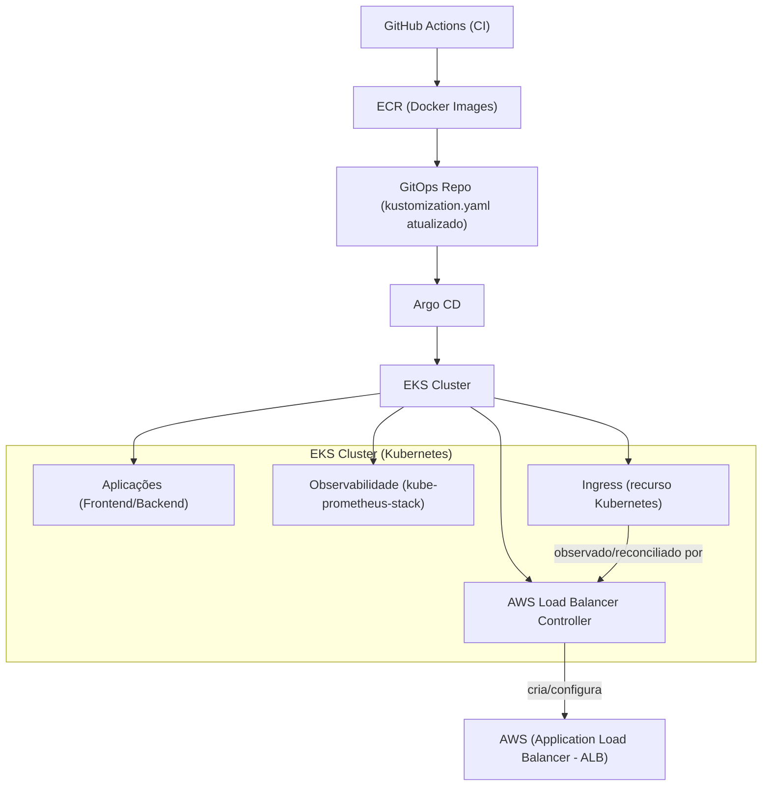

# 🚀 GitOps - ArgoCD

Este repositório centraliza os manifests Kubernetes e aplicações Argo CD de uma arquitetura GitOps.

Toda alteração versionada aqui pode ser sincronizada automaticamente no cluster pelo Argo CD.

---

## 🧠 Arquitetura



---

## ⚙️ Fluxo GitOps da aplicação

1. Código é alterado no repositório da aplicação.
2. Pipeline (GitHub Actions):
   - build da imagem Docker
   - push para o ECR
   - atualização das tags no `kustomization.yaml`
3. Commit é feito neste repositório (GitOps).
4. Argo CD detecta a mudança.
5. O cluster é sincronizado automaticamente.

👉 Nenhum `kubectl apply` manual é necessário para os recursos já gerenciados pelo Argo CD.

---

## 📂 Estrutura do repositório

```text
.
├── argocd/
│   ├── application.yaml                          # App principal (manifests do repositório)
│   └── alb-controller.yaml                       # App Argo CD do AWS Load Balancer Controller (Helm)
├── alb-controller/
│   └── service-account.yaml                      # ServiceAccount com anotação IRSA para o controller
├── Backend/
│   ├── deploy.yml
│   └── service.yml
├── Frontend/
│   ├── deploy.yml
│   ├── service.yml
│   └── ingress.yaml                              # Ingress com classe ALB
├── Observability/
│   └── kube-prometheus-stack/
│       └── observability.yaml                    # App Argo CD para chart Helm de observabilidade
└── kustomization.yaml
```

---

## 🚀 Argo CD

### App principal (GitOps)

```yaml
spec:
  source:
    repoURL: https://github.com/RildoDias08/GitOps.git
    targetRevision: HEAD
    path: .
```

Arquivo: `argocd/application.yaml`

### App do AWS Load Balancer Controller (Helm)

```yaml
spec:
  source:
    repoURL: https://aws.github.io/eks-charts
    chart: aws-load-balancer-controller
    targetRevision: 1.14.0
```

Arquivo: `argocd/alb-controller.yaml`

### App de observabilidade (Helm Chart)

```yaml
spec:
  source:
    repoURL: https://prometheus-community.github.io/helm-charts
    chart: kube-prometheus-stack
    targetRevision: 58.3.1
  destination:
    namespace: monitoring
  syncPolicy:
    automated:
      prune: true
      selfHeal: true
    syncOptions:
      - CreateNamespace=true
      - ServerSideApply=true
```

Arquivo: `Observability/kube-prometheus-stack/observability.yaml`

Para registrar essas aplicações no cluster via Argo CD (primeira vez):

```bash
kubectl apply -f argocd/application.yaml
kubectl apply -f argocd/alb-controller.yaml
kubectl apply -f Observability/kube-prometheus-stack/observability.yaml
```

---

## 🔄 Como atualizar ALB + Ingress + ServiceAccount

### 1) ServiceAccount (IRSA)

Arquivo: `alb-controller/service-account.yaml`

Atualize principalmente:
- `metadata.name`: deve permanecer igual ao nome usado no Helm (`aws-load-balancer-controller`)
- `metadata.namespace`: `kube-system`
- `annotations.eks.amazonaws.com/role-arn`: ARN da role IAM correta do ambiente

### 2) AWS Load Balancer Controller (Argo CD/Helm)

Arquivo: `argocd/alb-controller.yaml`

Valide/atualize:
- `spec.source.targetRevision`: versão do chart Helm
- `clusterName`: nome do cluster EKS
- `serviceAccount.create: false`
- `serviceAccount.name`: deve casar com o `metadata.name` do `service-account.yaml`
- `region`: região AWS
- `vpcId`: VPC do cluster

### 3) Ingress ALB

Arquivo: `Frontend/ingress.yaml`

Valide/atualize:
- `spec.ingressClassName: alb`
- annotations do ALB, como:
  - `alb.ingress.kubernetes.io/scheme`
  - `alb.ingress.kubernetes.io/target-type`
  - `alb.ingress.kubernetes.io/listen-ports`
- `rules` e `paths` para rotear `/api` (backend) e `/` (frontend)

### 4) Aplicar no fluxo GitOps

1. Commit das mudanças neste repositório.
2. Push para o branch monitorado pelo Argo CD.
3. Argo CD sincroniza automaticamente.

---

## 🔄 Kustomize

A aplicação (Frontend/Backend) utiliza Kustomize para gerenciar manifests e tags de imagem.

Exemplo:

```yaml
images:
  - name: <aws_account>.dkr.ecr.us-east-1.amazonaws.com/app/backend
    newTag: <image-tag>
```

Arquivo: `kustomization.yaml`

---

## 🧩 Conceitos aplicados

- GitOps (Git como fonte da verdade)
- Continuous Deployment com Argo CD
- Kustomize para gerenciamento de manifests
- Helm Chart via Argo CD (ALB Controller e observabilidade)
- Ingress via AWS Load Balancer Controller
- Monitoramento com `kube-prometheus-stack`

---

## 📌 Observações

- O cluster não é atualizado manualmente para recursos gerenciados pelo Argo CD.
- Toda mudança deve ser feita via Git.
- O Argo CD garante consistência entre o estado no Git e no cluster.
- O `ServiceAccount` do ALB Controller deve existir com a anotação IRSA correta antes do controller operar com as permissões esperadas.

---

## 🚀 Próximos passos

- [ ] Configurar ambientes separados (`dev`/`prod`)
- [ ] Adicionar TLS/ACM no Ingress ALB
- [ ] Incluir dashboards e alertas customizados no Prometheus/Grafana
- [ ] Evoluir para padrão App of Apps

---

## 💡 Sobre o projeto

Este repositório faz parte de uma arquitetura cloud com:

- Terraform (infraestrutura)
- EKS (Kubernetes)
- GitHub Actions (CI)
- ECR (container registry)
- Argo CD (CD via GitOps)
- Prometheus + Grafana (observabilidade)

---

## 📈 Objetivo

Demonstrar na prática um fluxo completo de:

👉 CI + GitOps + Kubernetes + Observabilidade
