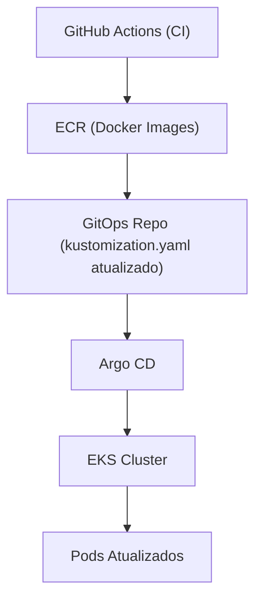

# 🚀 GitOps Repository - Argo CD Deployment

Este repositório mostra o deploy da aplicação no cluster Kubernetes utilizando a abordagem GitOps.

Toda alteração neste repositório é automaticamente sincronizada com o cluster através do Argo CD.

---

## 🧠 Arquitetura



---

## ⚙️ Fluxo GitOps

1. Código é alterado no repositório da aplicação
2. Pipeline (GitHub Actions):

   * build da imagem Docker
   * push para o ECR
   * atualização da tag no `kustomization.yaml`
3. Commit é feito neste repositório (GitOps)
4. O Argo CD detecta a mudança
5. O cluster é automaticamente sincronizado

👉 Nenhum `kubectl apply` manual é necessário

---

## 📂 Estrutura do Repositório

```text
.
├── argocd/
│   └── application.yaml   # Definição da aplicação no Argo CD
├── k8s/
│   ├── deployment.yaml
│   ├── service.yaml
│   └── kustomization.yaml
```

---

## 🚀 Argo CD

O Argo CD está configurado para monitorar este repositório e aplicar as mudanças automaticamente no cluster.

### Application

```yaml
spec:
  source:
    repoURL: https://github.com/RildoDias08/GitOps.git
    targetRevision: HEAD
    path: k8s
```

---

## 🔄 Kustomize

O deploy utiliza Kustomize para gerenciar as versões da aplicação.

A imagem é atualizada automaticamente pelo pipeline:

```yaml
images:
  - name: app/backend
    newTag: <image-tag>
```

---

## 🧩 Conceitos aplicados

* GitOps (Git como fonte da verdade)
* Continuous Deployment com Argo CD
* Integração com GitHub Actions
* Uso de OIDC para autenticação segura
* Kustomize para gerenciamento de manifests

---

## 📌 Observações

* O cluster não é atualizado manualmente
* Toda mudança deve ser feita via Git
* O Argo CD garante consistência entre Git e cluster

---

## 🚀 Próximos passos

* [ ] Implementar ambientes (dev / prod)
* [ ] Adicionar Ingress (ALB)
* [ ] Integração com banco (RDS)
* [ ] Estrutura App of Apps

---

## 💡 Sobre o projeto

Este repositório faz parte de um projeto maior de arquitetura cloud utilizando:

* Terraform (infraestrutura)
* EKS (Kubernetes)
* GitHub Actions (CI)
* ECR (container registry)
* Argo CD (CD via GitOps)

---

## 📈 Objetivo

Demonstrar na prática a implementação de um fluxo completo de:

👉 CI + GitOps + Kubernetes + Cloud

---
