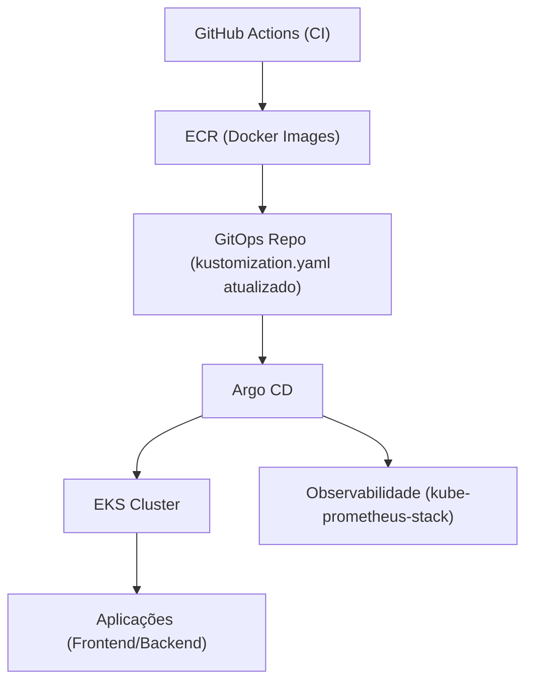

# 🚀 GitOps - ArgoCD

Este repositório centraliza os manifests Kubernetes e aplicações Argo CD de uma arquitetura GitOps.

Toda alteração versionada aqui pode ser sincronizada automaticamente no cluster pelo Argo CD.

---

## 🧠 Arquitetura



---

## ⚙️ Fluxo GitOps da aplicação

1. Código é alterado no repositório da aplicação.
2. Pipeline (GitHub Actions):
   - build da imagem Docker
   - push para o ECR
   - atualização das tags no `kustomization.yaml`
3. Commit é feito neste repositório (GitOps).
4. Argo CD detecta a mudança.
5. O cluster é sincronizado automaticamente.

👉 Nenhum `kubectl apply` manual é necessário para os recursos já gerenciados pelo Argo CD.

---

## 📂 Estrutura do repositório

```text
.
├── argocd/
│   └── application.yaml                          # App principal (manifests do repositório)
├── Backend/
│   ├── deploy.yml
│   └── service.yml
├── Frontend/
│   ├── deploy.yml
│   └── service.yml
├── Observability/
│   └── kube-prometheus-stack/
│       └── observability.yaml                    # App Argo CD para chart Helm de observabilidade
└── kustomization.yaml
```

---

## 🚀 Argo CD

### App principal (GitOps)

```yaml
spec:
  source:
    repoURL: https://github.com/RildoDias08/GitOps.git
    targetRevision: HEAD
    path: .
```

Arquivo: `argocd/application.yaml`

### App de observabilidade (Helm Chart)

```yaml
spec:
  source:
    repoURL: https://prometheus-community.github.io/helm-charts
    chart: kube-prometheus-stack
    targetRevision: 58.3.1
  destination:
    namespace: monitoring
  syncPolicy:
    automated:
      prune: true
      selfHeal: true
    syncOptions:
      - CreateNamespace=true
      - ServerSideApply=true
```

Arquivo: `Observability/kube-prometheus-stack/observability.yaml`

Para registrar essa aplicação no cluster via Argo CD:

```bash
kubectl apply -f Observability/kube-prometheus-stack/observability.yaml
```

---

## 🔄 Kustomize

A aplicação (Frontend/Backend) utiliza Kustomize para gerenciar manifests e tags de imagem.

Exemplo:

```yaml
images:
  - name: <aws_account>.dkr.ecr.us-east-1.amazonaws.com/app/backend
    newTag: <image-tag>
```

Arquivo: `kustomization.yaml`

---

## 🧩 Conceitos aplicados

- GitOps (Git como fonte da verdade)
- Continuous Deployment com Argo CD
- Kustomize para gerenciamento de manifests
- Helm Chart via Argo CD (observabilidade)
- Monitoramento com `kube-prometheus-stack`

---

## 📌 Observações

- O cluster não é atualizado manualmente para recursos gerenciados pelo Argo CD.
- Toda mudança deve ser feita via Git.
- O Argo CD garante consistência entre o estado no Git e no cluster.
- A stack de observabilidade é entregue por uma `Application` separada do Argo CD.

---

## 🚀 Próximos passos

- [ ] Configurar ambientes separados (`dev`/`prod`)
- [ ] Adicionar Ingress (ALB)
- [ ] Incluir dashboards e alertas customizados no Prometheus/Grafana
- [ ] Evoluir para padrão App of Apps

---

## 💡 Sobre o projeto

Este repositório faz parte de uma arquitetura cloud com:

- Terraform (infraestrutura)
- EKS (Kubernetes)
- GitHub Actions (CI)
- ECR (container registry)
- Argo CD (CD via GitOps)
- Prometheus + Grafana (observabilidade)

---

## 📈 Objetivo

Demonstrar na prática um fluxo completo de:

👉 CI + GitOps + Kubernetes + Observabilidade
